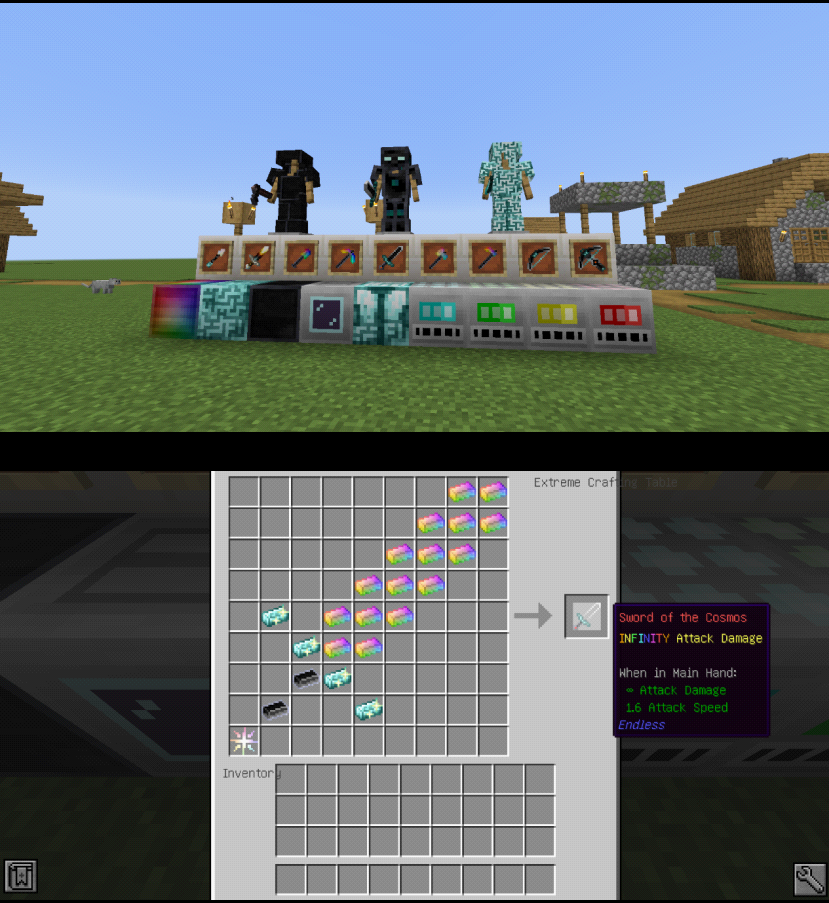

本模组是无尽贪婪的1.16.5非官方移植版。

与原作玩法大体上相同，但未还原原版无尽的特殊渲染。

目前联动了一小部分模组，如：冰火传说 / 冰与火之歌，植物魔法，CraftTweaker，等价交换重制版，龙之研究等。

在遵循开源协议MIT的情况下，你可以随意使用本模组。

Avaritia Endless is an unofficial port of Avaritia(https://www.curseforge.com/minecraft/mc-mods/avaritia-1-10) . It use 1.16.5-Forge.

The degree of completion of Avaritia Endless is very high. You can use extremely powerful infinity tools, weapons and armors in 1.16.5 again. What’s more, the core of avaritia——complex recipes is also recreated. So you must pay a huge price to get an infinity ingot.

I hope that you may like this mod!

Here are some pictures of Avaritia Endless.

Due to the technical problem, special render such as the stars on the infinity sword is not available.

Avaritia Endless has linkage with other mods such as Botania. If you install these mods, new singularities will be available.

If you want to use Avaritia Endless in modpacks, please go ahead.

If you want to feedback some problems, please go to github https://github.com/yuoft/Endless/issues .

Avaritia Endless is compatible with Crafttweaker. Access https://www.mcmod.cn/post/2306.html (Chinese) to get more details.

If you want to donate, please access https://afdian.net/@yuo123 (Chinese), thank you!